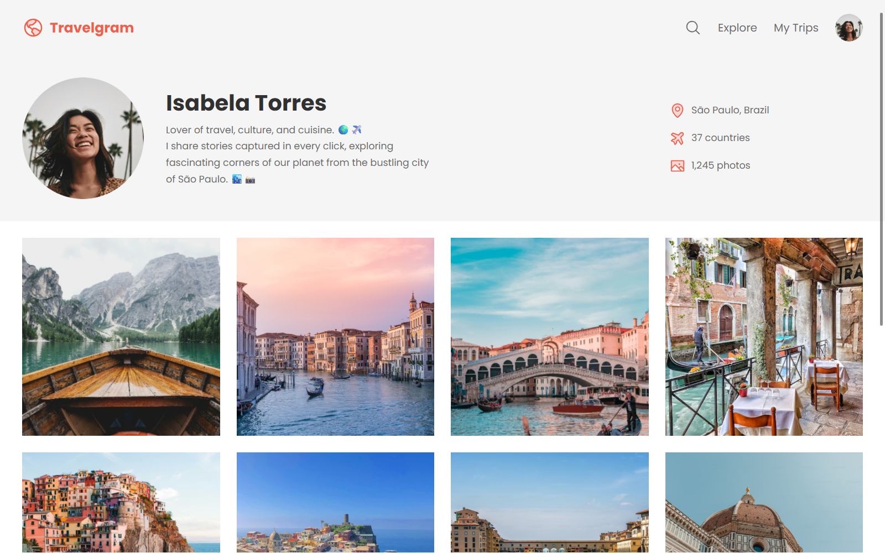

# Travelgram

A responsive travel profile page UI with a photo grid, built with HTML and CSS.

## Overview

Travelgram is a static, single-page layout that mimics a social/travel profile experience (profile header, location/travel stats, and a gallery feed). This project highlights my ability to build a clean UI from a design using semantic HTML, modern CSS, and reusable layout patterns.

**Demo:**



---

## Features

- ✅ Profile header layout (avatar, bio, and quick stats)
- ✅ Responsive photo gallery grid using Flexbox + wrapping
- ✅ Clean navigation bar with icons and user avatar
- ✅ Design tokens with CSS variables + consistent typography

---

## Tech Stack

**Frontend:**

- HTML5
- CSS3 (Flexbox)

**Other Tools:**

- Google Fonts (Poppins)

---

## Getting Started

### Prerequisites

- Any modern browser (Chrome, Firefox, Edge)

### Installation

1. **Clone the repository:**

```bash
git clone https://github.com/rachelmgaldino/travelgram.git
cd travelgram
```

2. **Run locally (choose one):**

- Open `index.html` directly in your browser, or
- Use VS Code Live Server and open `index.html`

---

## Project Structure

```
travelgram/
├── index.html
├── styles/
│   ├── global.css
│   ├── nav.css
│   ├── header.css
│   ├── main.css
│   ├── footer.css
│   └── index.css
└── assets/
    ├── travelgram-demo.png
    ├── Logo.svg
    ├── icons/
    └── images/
```

---

## What I Learned

This project taught me:

- How to structure a profile layout with flexible containers and predictable spacing
- How to build an image gallery that maintains consistent sizing (`object-fit: cover`) while wrapping cleanly
- How to keep styles scalable using CSS variables and small, focused style files

---

## What I’d Improve

If I were to rebuild this project, I would:

- [ ] Add responsive breakpoints for small screens (stack header columns, reduce image sizes)
- [ ] Improve accessibility (replace `alt="..."` placeholders with descriptive text and add visible focus states)
- [ ] Turn the navigation and footer items into real links/routes

---

## Contact

**Rachel Galdino**

- Email: rachel.galdino@proton.me
- LinkedIn: https://linkedin.com/in/rachel-galdino
- GitHub: https://github.com/rachelmgaldino

---

## Acknowledgments

- Design inspiration from a UI layout challenge / portfolio exercise
